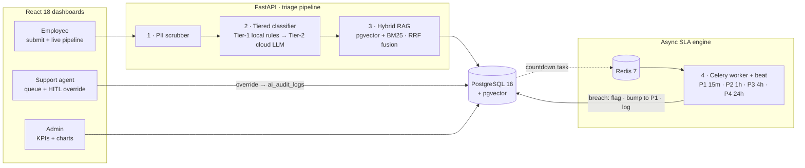

<div align="center">

# AutoTriage-ITSM

**Enterprise AI-augmented ITSM — triage, troubleshoot and escalate tickets with a production-shaped AI pipeline.**

[](https://github.com/MahimVyas/AutoTriage-ITSM/actions/workflows/ci.yml)
[](https://github.com/MahimVyas/AutoTriage-ITSM/actions/workflows/pages.yml)
[](https://mahimvyas.github.io/AutoTriage-ITSM/)
[](https://www.python.org/)
[](https://fastapi.tiangolo.com/)
[](https://react.dev/)
[](https://www.postgresql.org/)

**[Live Demo](https://mahimvyas.github.io/AutoTriage-ITSM/)** · **[API Docs](http://localhost:8000/docs)** · **[Quick Start](#quick-start)**

</div>

---

## Overview

AutoTriage-ITSM takes an employee's free-text incident report and runs it through a complete
triage pipeline: **PII redaction → tiered AI classification with strict Pydantic JSON schemas →
hybrid RAG (pgvector + BM25) troubleshooting guidance → an async Redis/Celery SLA escalation
engine** — with one-click human-in-the-loop overrides recorded in `ai_audit_logs`.

Everything is surfaced through three role-based dashboards (Employee, Support Agent, Admin) in a
fully responsive React UI with light/dark themes, plus an animated architecture modal that
explains the system block by block.

> **Zero-friction by design** — no LLM API keys required. Deterministic classification, embedding
> and RAG fallbacks keep the platform fully functional offline; add a key anytime to switch on
> Tier-2 cloud intelligence.

## Highlights

| | Capability |
|---|---|
| 🔒 | **PII scrubbing before AI** — regex engine redacts SSN, cards, emails, IPs, passwords, API keys and phone numbers before any model or store sees the text |
| 🧠 | **Tiered AI classification** — instant local rules first; cloud LLM (GPT-4o-mini / Gemini 1.5 Flash) only when confidence < 0.85 or the ticket is SECURITY; deterministic rule fallback underneath |
| 🔎 | **Hybrid RAG** — pgvector cosine similarity + BM25 lexical search fused with Reciprocal Rank Fusion → exactly 3 concise L1 steps |
| ⏱️ | **Async SLA escalation** — Celery countdown tasks per severity (P1 15m · P2 1h · P3 4h · P4 24h) with a 30s beat sweeper backstop |
| 🧑‍💻 | **Human-in-the-loop** — agents override AI decisions in one click; every correction is stamped into `ai_audit_logs` and reschedules the SLA window |
| 📊 | **Three dashboards** — employee submission with live pipeline indicator, filterable agent queue, admin KPIs and charts |
| 🎨 | **Modern UI** — responsive from phone to desktop, persisted light/dark mode with an animated theme switch, animated flow diagram in the **Tech Stack** modal |
| 🚀 | **Deployment-ready** — production compose stack behind nginx, CI boots the full stack on every push, static demo on GitHub Pages |

## Architecture



### The four pipelines

1. **PII scrubbing** — `backend/src/services/pii_scrubber.py` · matches are replaced with `[REDACTED_SENSITIVE_DATA]` and a redaction report is returned to the UI.
2. **Tiered classification** — `backend/src/services/ai_classifier.py` · **Tier 1** local keyword/heuristic rules return `category`, `subcategory`, `severity` and `confidence` in ~0 ms. **Tier 2** (cloud LLM, structured JSON validated by Pydantic) runs only when confidence `< 0.85` **or** the category is `SECURITY`. A deterministic rule fallback guarantees availability with no keys.
3. **Hybrid RAG** — `backend/src/services/rag_engine.py` · the scrubbed ticket is embedded (1536-d), searched by vector similarity **and** BM25, fused with RRF, and prompted for exactly 3 L1 steps with citations.
4. **SLA escalation** — `backend/src/workers/sla_worker.py` · on creation a delayed task is queued with `countdown = severity budget`. When it fires on a still-`OPEN` ticket: `is_sla_breached = True`, severity → `P1_CRITICAL`, status → `ESCALATED`, event written to `sla_events`.

### SLA windows

| Severity | Budget | On breach |
|---|---|---|
| `P1_CRITICAL` | 15 min | Flag ticket · bump to P1 · write `sla_events` |
| `P2_HIGH` | 1 hour | ″ |
| `P3_MEDIUM` | 4 hours | ″ |
| `P4_LOW` | 24 hours | ″ |

## Tech stack

| Layer | Technologies |
|---|---|
| **Frontend** | React 18 · Vite · Tailwind CSS · Lucide icons · shadcn-style UI primitives · Recharts |
| **Backend** | FastAPI (Python 3.11+) · Pydantic v2 · SQLAlchemy 2 async · Alembic · Uvicorn |
| **Data** | PostgreSQL 16 + pgvector (1536-d vectors, cosine index) |
| **Queue** | Redis 7 · Celery worker + beat (delayed SLA tasks, 30 s safety-net sweeper) |
| **AI / ML** | OpenAI `gpt-4o-mini` · Gemini 1.5 Flash (optional) · local rule "SLM" · rank_bm25 + RRF |
| **Infra** | Docker Compose (dev + prod) · Nginx · GitHub Actions · GitHub Pages |

## Quick start

### One script (easiest)

```bash
./start.sh              # full stack in Docker, waits for health, prints URLs
./start.sh --status     # what is running
./start.sh --logs       # tail all logs
./start.sh --test       # backend smoke tests + frontend build check
./start.sh --stop       # shut everything down
./start.sh --reset      # wipe databases/volumes and re-seed from scratch
./start.sh --local      # infra in Docker, backend/frontend run on your machine
```

The script auto-detects Docker (and offers to start Docker Desktop), seeds the database on first
boot, waits until the API is healthy, and prints the URLs to open.

### Plain Docker

```bash
docker compose up --build
# UI   → http://localhost:5173
# API  → http://localhost:8000/docs
```

### Local development

```bash
docker compose up -d postgres redis
cd backend  && pip install -r requirements.txt && python seed.py
uvicorn src.main:app --reload                                       # terminal 1
celery -A src.workers.sla_worker.celery_app worker --loglevel=info  # terminal 2
cd ../frontend && npm install && npm run dev                        # terminal 3
```

### Verify

```bash
cd backend  && python tests/test_smoke.py   # 10 offline tests, no keys needed
cd frontend && npx vite build               # production build check
```

Optional: drop `OPENAI_API_KEY` or `GOOGLE_GEMINI_API_KEY` into the root `.env`
(see `.env.example`) to enable Tier-2 cloud classification.

## Try the demo

1. **Employee** — paste a description containing an SSN, card number, IP and password, submit,
   and watch the four pipeline stages complete. The result shows what was redacted, which AI
   tier ran, the confidence score and the 3 RAG steps.
2. **Support Agent** — filter by priority/category/SLA, open a ticket, compare raw vs scrubbed
   text, then use **HITL override** to correct the classification — the correction lands in
   `ai_audit_logs` and the SLA window is rescheduled.
3. **Admin** — KPI cards (total tickets, breach rate, AI accuracy, cost saved via Tier-1 local
   routing), a stacked bar chart by category and a pie chart of Tier-1 vs Tier-2 distribution.
4. **SLA escalation** — create a P1 and leave it `OPEN`: the Celery worker fires from Redis at
   the deadline, breaches it and writes an `sla_events` row (the beat sweeper backstops).
5. **Tech Stack (navbar)** — opens the animated request-flow diagram; hover/tap any block for
   the technology behind it, plus a full stack breakdown by layer.
6. **Dark mode** — the moon/sun toggle switches themes with an animated reveal; the choice is
   saved and restored on reload.

## Deployment

### GitHub Pages (live static demo)

Every push to `main` runs `.github/workflows/pages.yml`, which builds the frontend with
`VITE_DEMO=true` and deploys it to **<https://mahimvyas.github.io/AutoTriage-ITSM/>**.

Static hosting has no FastAPI/Postgres, so demo builds route the API client to
`frontend/src/lib/demoApi.js` — an **in-browser implementation of the exact same API contract**
(same regex scrub → tiered classify → runbook steps → SLA windows, seeded with the same demo
tickets). The header shows an amber *Demo mode · in-memory* pill so it's clear you're looking
at the static demo. Run `./start.sh` locally for the real full-stack experience.

> One-time repo setting: **Settings → Pages → Source: GitHub Actions**.

### Production (any Docker host / VPS)

```bash
docker compose -f docker-compose.prod.yml up -d --build

# UI     → http://localhost:5173          (UI_PORT)
# API    → http://localhost:8000/docs     (API_PORT)
# health → http://localhost:5173/api/health
```

| Concern | Production behaviour |
|---|---|
| Frontend | Multi-stage build (`npm ci` → `vite build`) served by **nginx** — SPA fallback + immutable asset caching |
| API proxy | nginx forwards `/api`, `/docs`, `/openapi.json` → FastAPI (same-origin, no CORS needed) |
| Bind mounts | **None** — app code lives in the images; data persists in named volumes |
| Postgres / Redis | **No published ports** — reachable only on the internal compose network |
| Backend | Runs with `--workers 2` and a `/api/health` healthcheck; the UI waits for it |
| Credentials | Override via env: `POSTGRES_USER`, `POSTGRES_PASSWORD`, `REDIS_PASSWORD`, `UI_PORT`, `API_PORT` |
| LLM keys | Optional: `OPENAI_API_KEY` / `GOOGLE_GEMINI_API_KEY` (rule fallback keeps it working keyless) |

Put it behind TLS by pointing your reverse proxy (Caddy/Traefik/cloud LB) at the `frontend` (80)
and `backend` (8000) ports, or set `UI_PORT=80`.

### CI / CD (GitHub Actions)

`.github/workflows/ci.yml` runs on every push/PR to `main`:

1. **backend-tests** — 10 offline smoke tests on Python 3.11 (SQLite, no keys)
2. **frontend-build** — production `vite build` on Node 20
3. **docker-images** — validates both compose files, builds the production images, boots the
   full stack and curls `/api/health` through the nginx proxy

To ship to a cloud later, add a registry push step (GHCR/ECR) to the `docker-images` job and a
`docker compose up -d` on the target host — the compose file needs no changes.

## Project structure

```
AutoTriage-ITSM/
├── docker-compose.yml            # dev stack: postgres(pgvector) · redis · backend · worker · beat · frontend
├── docker-compose.prod.yml       # production stack: no bind mounts, nginx static UI, internal DB/queue
├── .github/workflows/ci.yml      # CI: smoke tests + vite build + full prod stack boot check
├── .github/workflows/pages.yml   # deploys the static demo build to GitHub Pages
├── .env.example                  # optional LLM keys
├── start.sh                      # one-script runner (--test/--local/--status/--logs/--stop/--reset)
├── backend/
│   ├── Dockerfile · requirements.txt · pyproject.toml · alembic.ini
│   ├── seed.py                   # python seed.py [--reset]
│   ├── initdb/001_extensions.sql # CREATE EXTENSION vector
│   ├── migrations/               # alembic env + versions/
│   ├── tests/test_smoke.py       # 10 offline smoke tests
│   └── src/
│       ├── main.py               # FastAPI app
│       ├── config.py             # settings (env-driven)
│       ├── database.py           # async models: users · tickets · kb_documents · ai_audit_logs · sla_events
│       ├── schemas.py            # Pydantic v2 schemas (incl. TicketClassificationResponse)
│       ├── api/endpoints.py      # /api/tickets · /api/analytics · /api/health …
│       ├── services/
│       │   ├── pii_scrubber.py   # Pipeline 1
│       │   ├── ai_classifier.py  # Pipeline 2 (Tier 1 → Tier 2 → fallback)
│       │   ├── embeddings.py     # OpenAI embeddings w/ deterministic local fallback
│       │   └── rag_engine.py     # Pipeline 3 (pgvector + BM25 + RRF → 3 steps)
│       └── workers/sla_worker.py # Pipeline 4 (Celery/Redis delayed tasks)
└── frontend/                     # React + Vite + Tailwind + Lucide + shadcn-style UI
    ├── Dockerfile                # dev (vite dev server, HMR)
    ├── Dockerfile.prod           # multi-stage: npm ci → vite build → nginx
    ├── nginx.conf                # serves dist + proxies /api, /docs → FastAPI
    └── src/
        ├── App.jsx               # navbar, role switcher, animated dark-mode toggle
        ├── index.css             # light/dark design tokens + theme-switch animation
        ├── lib/api.js            # API client (routes to demoApi when VITE_DEMO=true)
        ├── lib/demoApi.js        # in-browser demo backend for the GitHub Pages build
        ├── components/
        │   ├── ui/               # button · badge · card · input · tabs · dialog (shadcn-style)
        │   ├── TechStackModal.jsx      # animated architecture diagram + stack breakdown
        │   └── TicketDetailModal.jsx   # AI confidence, raw vs scrubbed, RAG steps, HITL override
        └── views/
            ├── EmployeeView.jsx        # submission + live pipeline indicator
            ├── AgentDashboard.jsx      # responsive queue (cards on mobile, table on desktop)
            └── AdminAnalytics.jsx       # KPI cards + bar/pie charts
```

---

<div align="center">

Built by **Mahim Vyas**

</div>
